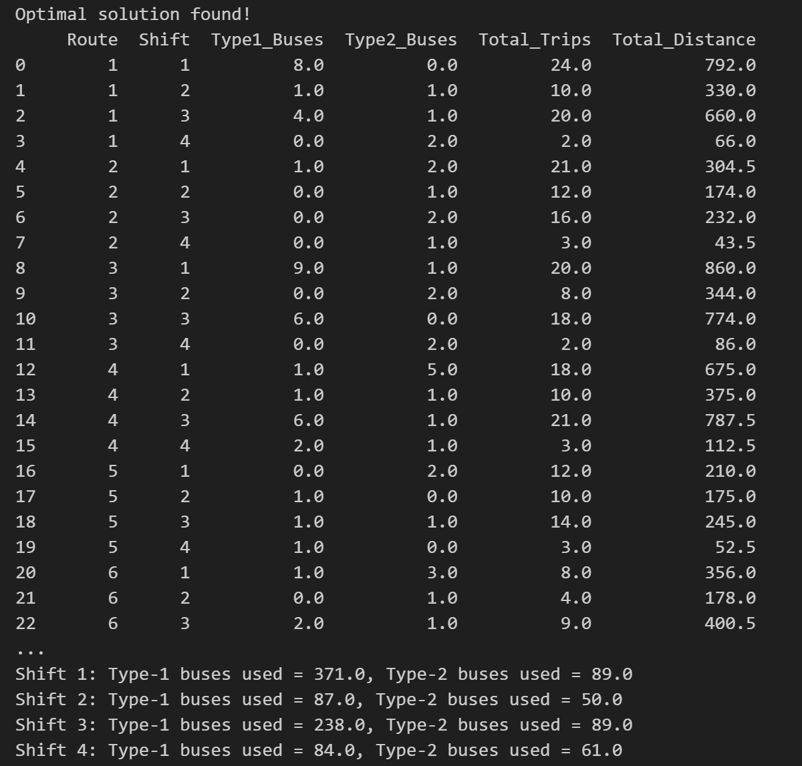
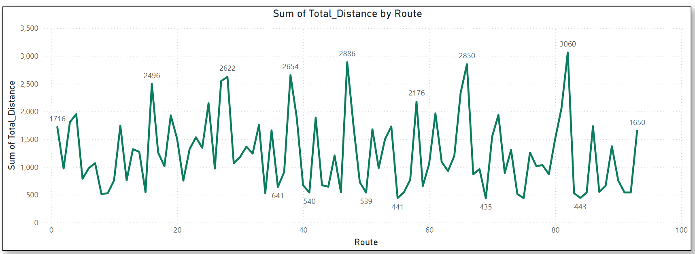
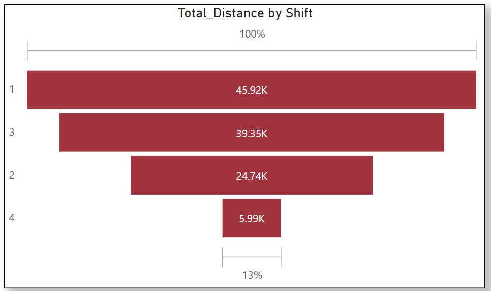
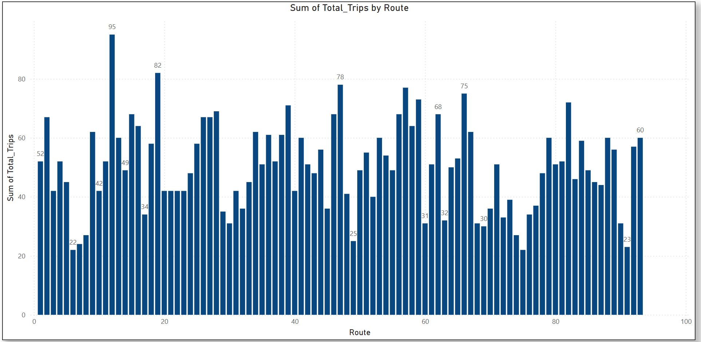
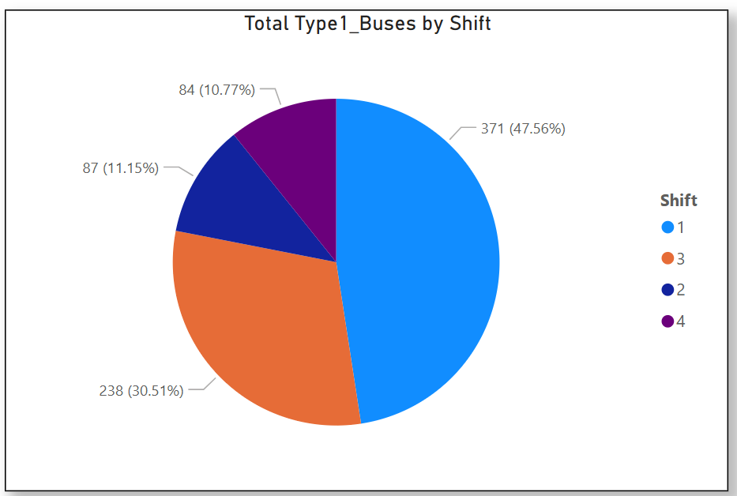
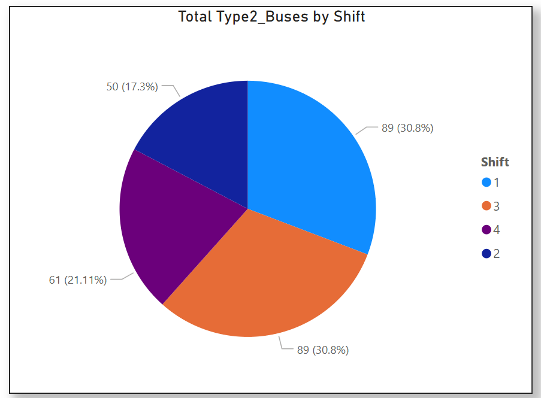

# Modeling-and-Analysis-of-Bus-Scheduling-Systems-of-Urban-Public-Bus-Transport-using-OR-Tools
## 🧠 Project Overview
This project addresses the complex challenge of urban bus network scheduling, where the goal is to efficiently assign buses to various city routes and time shifts while satisfying real-world constraints such as demand, fleet availability, and service reliability.

The work is inspired by a research paper titled "An Optimization Model for Urban Bus Scheduling", which presented a linear programming approach focused primarily on minimizing the total number of bus trips across routes and shifts. While effective as a conceptual model, it simplified many practical factors like fleet limitations, varying operational costs, and minimum service frequencies.

## 🔍 Original Model Focus:
Objective: Minimize total number of trips

Assumptions: Uniform trip costs, unconstrained fleet, and limited real-world parameters

## 🚀 What I Improved
To better reflect real-world transit operations, I extended and enhanced the original model by incorporating:

### 🎯 New Objective Function:
Shifted the goal from minimizing trip count to minimizing total operational cost, making the model more realistic and cost-aware.

### 🚌 Fleet Constraints:
Introduced upper limits on the number of Type-1 and Type-2 buses available per shift, reflecting actual resource limitations.

### ⏳ Minimum Trip Requirements per Shift:
Added service-level constraints to ensure that each route gets enough trips to limit passenger waiting time to 30 minutes or less.

### 🛣️ Distance Modeling:
Estimated total travel distance using trip duration × average speed (30 km/h), which helps in analyzing route efficiency and potential fuel use.

### 💰 Cost Differentiation by Bus Type:
Incorporated real-world operational costs for two bus types:

Type-1: 60 passengers, $100/trip

Type-2: 90 passengers, $150/trip

By integrating these realistic parameters into the optimization model, I developed a solution that not only satisfies demand but also optimizes resource utilization and minimizes total operational cost — providing a more scalable, actionable tool for urban transit planning.

## 🧩 Modeling Approach
This optimization model was implemented using Python and Google OR-Tools (CP-SAT Solver) to handle integer variables and real-world constraints efficiently. The goal was to build a solution that can be applied by transit agencies to streamline their scheduling operations.

### 🎯 Objective Function: Minimize Operational Cost
Unlike the original model which minimized the total number of trips, my extended model focuses on minimizing the total cost of operating the buses.
The cost depends on:

The number of buses of each type allocated to each route and shift

The number of trips made by those buses (i.e., trip frequency)

The cost per trip ($100 for Type-1, $150 for Type-2)

Total Cost= ∑𝑖,𝑗 (𝑥𝑖,𝑗 ⋅ 100 ⋅ 𝑇𝑖,𝑗 + 𝑦𝑖,𝑗 ⋅ 150 ⋅ 𝑇𝑖,𝑗)

Where:

𝑥𝑖,j and 𝑦𝑖,𝑗  are the number of Type-1 and Type-2 buses for route i in shift j

Ti,j  is the number of trips in that shift

## 📊 Model Features & Constraints
The model includes several practical constraints that reflect real-world scheduling needs:

### ✅ Demand Satisfaction (per Route, per Shift)
Ensure that the total capacity offered by assigned buses is at least equal to the expected passenger demand for each route and shift.

### ✅ Fleet Availability Limits
Limit the total number of Type-1 (600) and Type-2 (90) buses used per shift, preventing overuse of available buses.

### ✅ Minimum Trip Requirement
Impose a minimum number of total trips per shift (e.g., 7 in Shift 1, 12 in Shift 2, etc.) to ensure buses maintain a frequency that prevents passenger waiting time from exceeding 30 minutes.

### ✅ Distance Calculation
For each route, the total distance covered is computed as:

Distance=(No. of buses)×(trip factor)×(average trip distance)
This enables additional analysis such as estimating fuel costs, carbon emissions, or wear and tear.

## 🛠️ Technologies Used

Python	          -Main programming language / 

Pandas	          -Data handling and preprocessing / 

Google OR-Tools	  -Optimization engine (CP-SAT solver) / 

CSV Dataset	      -Custom dataset with demand, trips, distances

## 📁 Output Details
The model outputs a structured schedule that shows:

🔢 Number of Type-1 and Type-2 buses assigned per route and shift

🚍 Total number of trips per route and shift

🛣️ Total distance traveled per route

📉 Overall cost breakdown

📆 Fleet usage summary for each shift

## 📚 Reference
"An Optimization Model for Urban Bus Scheduling"
This project extends the concepts from the original paper by integrating constraints and metrics that are essential for real-world decision-making.

📄 [(https://www.mirlabs.org/ijcisim/regular_papers_2014/IJCISIM_38.pdf)]

